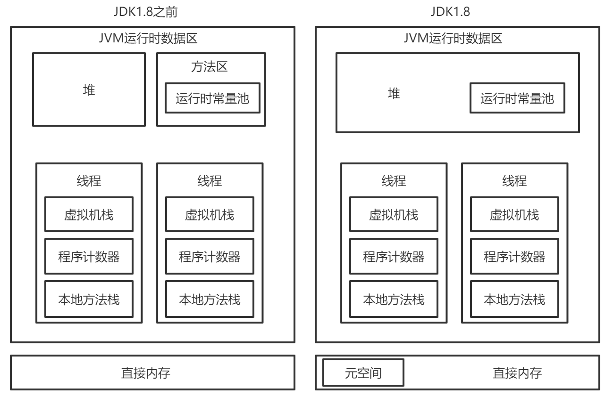

# Java JVM

## 1. 运行时数据区

Java 虚拟机在执行 Java 程序的过程中会把它管理的内存划分成若干个不同的数据区域。

#### 主要知识点：

* 运行时数据区的组成（JDK 1.8前后的区别）

* 每个区域存放的内容

* 每个区域具有的性质

##### 组成：

JVM 运行时数据区在1.8的时候发生了一些改变，接下来将说明1.8以前与1.8后的运行时数据区的区别

##### JDK 1.8之前

###### 组成：

程序计数器，虚拟机栈，本地方法栈，堆，方法区（包括运行时常量池）

###### 存放的内容：

* 程序计数器 （线程私有）

  > 存储每个线程**下一步将执行的JVM指令**, 如该方法为native的，则PC寄存器中不存储任何信息。
  >
  > 字节码解释器工作时通过改变这个计数器的值来选取下一条需要执行的字节码指令，分支、循环、跳转、异常处理、线程恢复等功能都需要依赖这个计数器来完成。

* 虚拟机栈（线程私有）

  > 存放当前线程中**局部基本类型的变量**(java中定义的八种基本类型: boolean、char、 byte、 short. int、 long、 float、double) 、**部分的返回结果**以及**Stack Frame, 非基本类型的对象在JVM栈上仅存放一个指向堆上的地址。**
  >
  > Java 虚拟机栈是由一个个栈帧组成，而每个栈帧中都拥有：**局部变量表、操作数栈、动态链接、方法出口信息**。

* 本地方法栈（线程私有）

  > 为虚拟机执行本地方法时服务的
  >
  > 存储每个native方法调用的状态

* 堆（线程共享）

  > 存储**对象实例**以及**数组值**的区域，可以认为Java中所有通过new创建的对象的内存都在此分配，Heap中的对象的内存需要等待GC进行回收。
  >
  > **此内存区域的唯一目的就是存放对象实例，几乎所有的对象实例以及数组都在这里分配内存。**

* 方法区（线程共享）

  > 存放所加载的类信息(名称、修饰符等)、类中的静态变量、 类中定义为final类型的常量、类中的Field信息、类中的方法信息、即时编译器编译后的代码等数据。

* 运行时常量池（线程共享）

  > 类中的固定的常量信息、方法和Field的引用信息等，其空间从方法区域中分配。

##### JDK 1.8及之后

###### 区别：

* **1.8 开始不存在永久代了**，元空间代替了永久代，方法区移到了元空间
* **方法区里面的那些东西，大部分都被移到堆里面去了，还剩下一些元数据被保存在元空间里面**

###### 元空间

**什么是元空间**

**元空间存放了什么**

**为什么选择元空间代替永久代**

